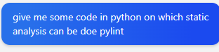
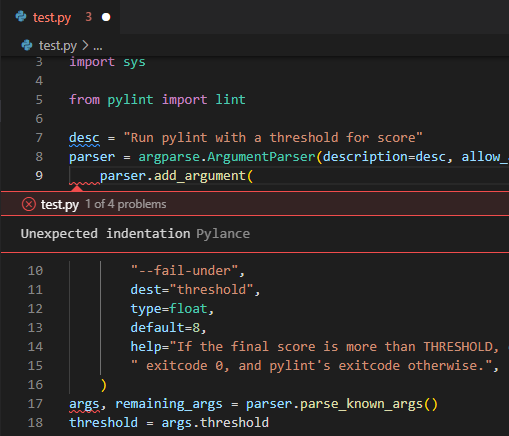

**Lab 5**

Keshav Somani 				    	 202001029

#
# Erroneous code 1: 
### **SOURCE** : Bing-Chatgpt 
The source of the code is Bing Chat.

On asking Bing-Chat : 

It returns for the code :

\# pylint: disable=missing-module-docstring

import argparse

import sys

from pylint import lint

desc = "Run pylint with a threshold for score"

parser = argparse.ArgumentParser(description=desc, allow\_abbrev=False)

parser.add\_argument(

`    `"--fail-under",

`    `dest="threshold",

`    `type=float,

`    `default=8,

`    `help="If the final score is more than THRESHOLD, exit with"

`    `" exitcode 0, and pylint's exitcode otherwise.",

)

args, remaining\_args = parser.parse\_known\_args()

threshold = args.threshold

run = lint.Run(remaining\_args, do\_exit=False)

score = run.linter.stats["global\_note"]

if score < threshold:

`    `sys.exit(run.linter.msg\_status)

## Static-Analysis using Pylint :
We had Installed Pylint Extension in VS-Code  

Created a **test.py** and imported the erroneous code in it 

## Output:
**Problems :** Pylint can identify the problems in the code.

**Indentation :** Pylint also identifies Bad - Indentation.

**Suggestions :** It also shows suggestions for better code writing and overall understandability of code. 

# Erroneous Code 2:
**Source Code: <https://github.com/andy-landy/traceback_with_variables.git>** ->: examples folder

**Change\_global\_printer.py**

def main():

`    `n = 0

`    `print(1 / n)

main()

