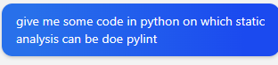
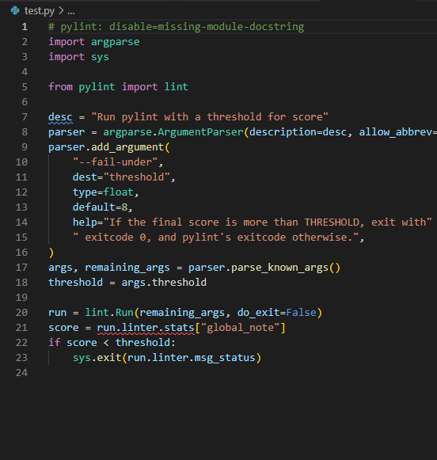
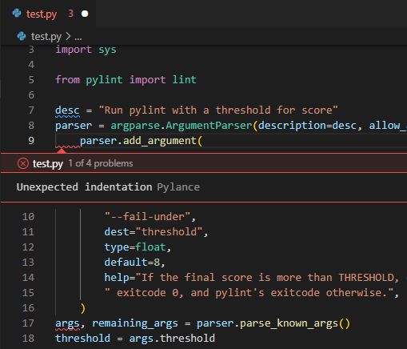
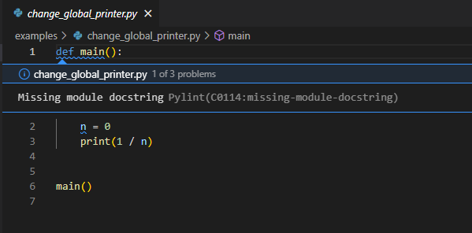

**Lab 5**

Keshav Somani 				    	 202001029

#

## Static-Analysis using Pylint :
We had Installed Pylint Extension in VS-Code  

Created a **test.py** and imported the erroneous code in it 

# Erroneous code 1: 
### **SOURCE** : Bing-Chatgpt 
The source of the code is Bing Chat.

On asking Bing-Chat : 

It returns for the code :

## Output:
**Problems :** Pylint can identify the problems in the code.

**Indentation :** Pylint also identifies Bad - Indentation.

**Suggestions :** It also shows suggestions for better code writing and overall understandability of code. 

# Erroneous Code 2:
**Source Code: <https://github.com/andy-landy/traceback_with_variables.git>** ->: examples folder

**Change\_global\_printer.py**

## Output:
**Missing Line:** Pylint is able to identify Missing-Lines / words.

# Analysis:
After testing over Erroneous Code 1 & 2. We can see multiple errors identified by Pylint .

Now we will analysis the output on the basis of correct detection and incorrect detection:

## Correct Detection :

1. ### Is - Error Detected
In Code 1 we can see multiple output , and can analyze that Pylint can successfully detect errors that are 

- Miscellaneous Typing 
- Wrong function / command written
- Indentation Errors 

## Incorrect Detection :
1. ### Is - Error Undetected:
In Code 2 we can see the function was asking to run command (1/0) which is mathematically invalid. Therefore , we can analyze that Pylint is unable to detect 

- Mathematically wrong codes
- Stuck in Loop Problems
1. ### Not- Error Detected:
In Code 2 we can see the function was unable to differentiate between Globally Pre-Defined and Defining functions

